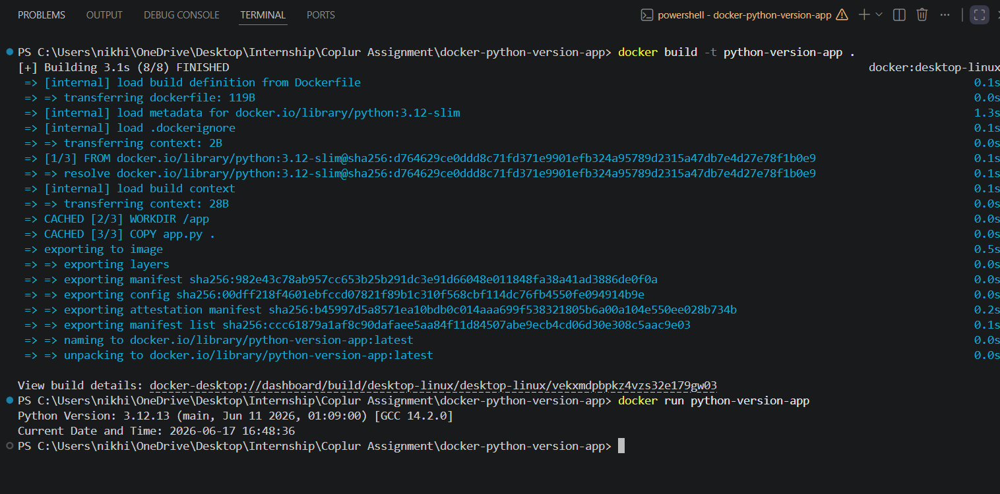

# Dockerized Python Version Application

This project demonstrates a simple Dockerized Python application using the official Python 3.12 Slim image.

## Features

- Uses `python:3.12-slim` as the base image
- Prints the Python version running inside the container
- Prints the current date and time
- Runs automatically when the container starts

## Project Structure

```text
docker-python-version-app/
├── app.py
├── Dockerfile
├── requirements.txt
├── README.md
└── screenshot.png
```

## Build the Docker Image

```bash
docker build -t python-version-app .
```

## Run the Container

```bash
docker run --rm python-version-app
```

## Sample Output

```text
Python Version: 3.12.x (main, ...)
Current Date and Time: 2026-06-17 15:42:18
```

## Screenshot

Add a screenshot of the container output after running:

